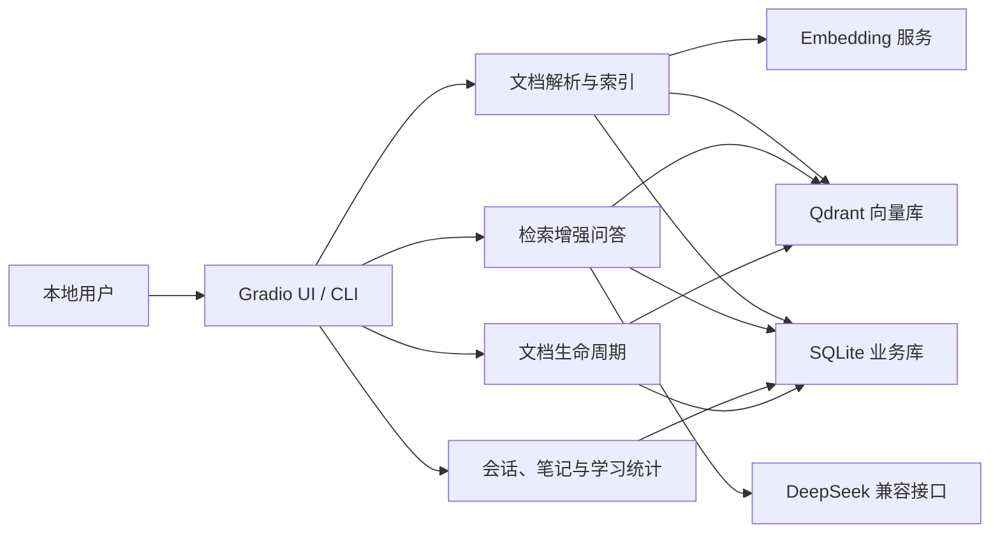

# 当前架构

## 1. 系统定位

Agent3 是本地单用户文档学习助手。系统接收 PDF / Markdown，建立可按 `document_id` 隔离的向量索引，并在问答时返回可追溯来源；SQLite 负责业务状态，Qdrant 负责向量检索，Gradio 提供桌面、平板和移动端 UI。

本架构不包含认证、多租户、Neo4j、公网部署或多实例一致性。

## 2. 逻辑架构

## 3. 模块职责

| 模块 | 当前职责 |
|---|---|
| `config.py` | 从环境变量构建运行配置并校验关键参数 |
| `pdf_parser.py` | 解析 PDF 文本并保留页码 |
| `markdown_parser.py` | 解析 Markdown 并保留章节、段落、行号 |
| `document_parser.py` | 按格式路由解析器 |
| `chunker.py` | 按定位信息切分文本，默认 1200 字符、160 重叠 |
| `embedding.py` | 调用 Embedding 服务并校验向量维度 |
| `qdrant_index.py` | collection、point 写入、搜索、计数和按文档删除 |
| `ingestion.py` | 串联校验、解析、分块、向量化、索引和目录写入 |
| `document_catalog.py` | 查询文档目录、筛选、排序和更新状态 |
| `qa.py` | 检索、上下文构建、回答生成和引用组装 |
| `document_scope.py` | 保存当前问答范围和短期会话上下文 |
| `memory_store.py` | SQLite schema、事务、会话、引用、笔记、学习事件和操作记录 |
| `learning.py` | 会话问答、笔记、统计和报告编排 |
| `lifecycle.py` | 归档、取消归档、删除、恢复和一致性校验 |
| `health.py` | 配置、Qdrant collection 和 SQLite 健康检查 |
| `backup.py` | SQLite 一致性备份 |
| `ui.py` / `ui.css` | Gradio 组件、回调、状态绑定和唯一运行时样式 |
| `cli.py` | 本地命令行入口 |

## 4. 核心数据流

### 4.1 文档索引

1. 校验文件类型，仅接受 PDF / Markdown。
2. 计算内容 hash 和稳定 `document_id`，识别重复内容。
3. 按文档类型解析定位信息。
4. 按定位边界切分文本。
5. 使用 `text-embedding-v4` 生成 1024 维向量。
6. 写入 `docqa_text-embedding-v4_dim1024` collection。
7. 将文档状态、统计、hash、模型和定位方案写入 SQLite。

失败信息进入文档目录；既有已索引文档不应因另一文档失败而被改写。

### 4.2 问答

1. UI / CLI 提交问题与 `document_filter`。
2. 问题向量化后在 Qdrant 中检索，按 `document_id` 过滤。
3. 低于阈值或没有命中时返回明确的 `no_results`，不伪造答案。
4. 命中片段被压缩到配置的上下文字符上限。
5. LLM 生成回答；引用仍来自检索结果，而不是模型自由生成。
6. 问题、答案状态、引用和学习事件在一个 SQLite 事务中保存。

### 4.3 会话与学习记录

- 持久记忆保存在 SQLite 的 session、turn、citation、note 和 learning event 表中；
- UI 同时维护受限的短期上下文，默认最近 6 轮、最多 4000 字符；
- 会话切换隔离问答历史；
- 文档范围切换会清空当前回答、来源和待保存笔记，但不会删除持久记录；
- 笔记与 session、turn、document 建立显式关联。

### 4.4 文档生命周期

- 归档：将状态改为 `archived`，保留 SQLite 记录和 Qdrant points；
- 取消归档：恢复为 `indexed`；
- 删除：必须确认，以 `document_id` 精确删除 Qdrant points，SQLite 保留 `deleted` tombstone 和操作记录；
- 删除失败：记录错误并回退到原状态或标记 `inconsistent`；
- 恢复：从 tombstone 的源文件重新索引，并要求恢复后的 `document_id` 不变；
- 一致性校验：比较 SQLite 预期 point 数和 Qdrant 实际 point 数。

## 5. 数据所有权与一致性

| 数据 | 权威存储 | 一致性规则 |
|---|---|---|
| 文档目录和生命周期状态 | SQLite | Qdrant 只保存可检索向量，不作为业务状态权威 |
| 文档向量 | Qdrant | point payload 必须携带 `document_id` 和来源定位信息 |
| 会话、回答、引用、笔记 | SQLite | 写入失败不能伪装为成功 |
| 当前 UI 选中范围 | UI state | 通过现有回调同步，不改变持久业务语义 |

SQLite 开启外键、10 秒 busy timeout，并在支持时使用 WAL。跨 SQLite 与 Qdrant 的删除无法成为单一数据库事务，因此通过前后计数、操作日志、状态机和失败回退实现补偿一致性。

## 6. 来源定位契约

- PDF：页码是业务定位事实；
- Markdown：章节、段落和行号是业务定位事实；
- Markdown 引用的页码字段在最终 SQLite schema 中允许为空，禁止伪造页码；
- `source_locator` 和 `document_id` 是服务层、UI 和测试共同依赖的契约。

## 7. UI 架构

UI 采用“顶部品牌栏 + 左侧空间导航 + 中间独立工作区 + 右侧上下文检查器”。桌面端三栏展示；平板端收缩导航或检查器；移动端使用导航抽屉和上下文底部面板。`src/doc_qa/ui.css` 是唯一运行时样式权威，业务数据仍由 `ui.py` 的真实回调提供。

详细视觉规则见 [设计规格](design-spec.md)。

## 8. 运行与安全边界

- 默认绑定 `127.0.0.1`，不是公网生产服务；
- API Key、Token 和 `.env` 只用于本地运行，不进入日志、文档或提交；
- 本地 Qdrant 可使用 `data/qdrant`，也可通过 URL 连接外部实例；
- 生命周期和故障测试必须使用临时 SQLite / Qdrant；
- 未实现认证、多租户、权限、限流、Secret Manager、多实例共享存储或线上灾备。

## 9. 已知架构风险

- Gradio 内部 DOM 与上传进度端点属于上游依赖，`upload_progress?upload_id=undefined` 404 尚未关闭；
- SQLite 与 Qdrant 是补偿一致性，不是分布式事务；
- 外部 Embedding / LLM 可用性和成本受供应方影响；
- 当前没有 CI，自动化门禁依赖本地执行。
