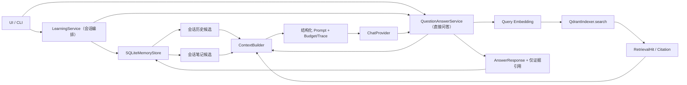

# CTX-001：在 Agent3 中复现上下文工程核心知识

> 状态：`approved / in_progress`
>
> 起草日期：2026-08-06
>
> 批准日期：2026-08-06
>
> 当前生命周期：Step 6 已完成并获负责人确认；Step 7 本地审查、文档收口和本地提交已完成，保持 `ready_for_review`，等待推送授权。
>
> 当前执行边界：Step 7 本地差异审查、全量门禁、权威文档收口和按意图创建本地提交已完成。推送、PR、合并仍须分别授权；不部署、不自动创建下一任务。

## 1. 用户目标与实际价值

### 用户目标

本地单用户在 Agent3 中围绕 PDF / Markdown 连续提问时，希望系统能够把当前问题、Qdrant 检索证据、当前会话历史和已有学习笔记组织成稳定、受预算约束、可观测的上下文，同时继续提供可追溯引用，并避免历史回答或用户笔记被误当成文档事实。

### 实际价值

- 将目前分散在 `qa.py`、`learning.py`、`memory_store.py` 和 UI 短期状态中的上下文逻辑收敛为一条可复用的 GSSC 流水线；
- 提升多轮追问中的指代理解与主题连续性，但不降低 RAG 的事实边界；
- 让笔记在后续问答中提供学习背景，而不是成为未经检索验证的事实来源；
- 用统一预算、稳定分区和构建报告降低上下文膨胀、截断不确定性和调试成本；
- 为后续上下文评测提供稳定、可断言的中间产物，而不是只能观察最终回答。

本任务是一个独立用户价值切片：**完成后，用户可在现有文档问答链路中获得“证据受控、历史可用、笔记可用、预算稳定、过程可查”的多源上下文问答。**

## 2. 前置条件与当前项目事实

- 项目：`E:\Agent\开发实践\Agent3-智能文档问答助手`；
- Git 分支：`main`；
- 工作区：起草前 `git status --short` 无输出；
- 当前状态：`idle`，没有活动任务；
- 最近完成：DOC-001 已归档，PR #1 已合并；
- 最近记录质量基线：全量 pytest 95 项通过，`compileall` 通过，CI 未配置；
- 当前产品：本地单用户 PDF / Markdown 文档学习助手，具备 Qdrant RAG、SQLite 会话记忆、引用、笔记和学习统计；
- Embedding：`text-embedding-v4` / 1024 维；
- Qdrant collection：`docqa_text-embedding-v4_dim1024`；
- 当前问答无检索命中时返回 `no_results`，不调用 LLM；
- 当前问答按 `document_id` 过滤 Qdrant，引用由检索结果构造；
- 当前没有统一的 `ContextBuilder`。

任务分类：`M`（跨 QA、学习编排、记忆读取、配置、测试和评测的中型功能/架构收敛）。任务获批准后，在 Step 0 完成架构边界复核；若发现必须改 schema、collection、外部依赖或产品权限，则升级评审并停止原范围。

权威顺序继续遵守：当前代码、测试、schema、配置和 Git 事实，高于本任务草稿和历史材料。

## 3. 当前 Agent3 的上下文处理现状

| 位置 | 当前行为 | 已有保护 | 当前局限 |
|---|---|---|---|
| `src/doc_qa/qa.py` | 检索 Qdrant、构造引用、分别拼接会话历史和文档片段、调用 LLM | System Prompt 明确文档片段不可信；历史仅用于指代；回答要求 JSON 和来源 ID | `_build_context`、`_build_conversation_context` 是私有且分散的字符串拼装；没有统一 Packet、总预算或构建报告 |
| `src/doc_qa/learning.py` | 在未显式传入上下文时读取 SQLite 最近会话，再交给 QA | 会话 ID 隔离；问答后事务保存 | 只注入历史，不注入笔记；上下文选择策略由多个模块共同决定 |
| `src/doc_qa/memory_store.py` | `recent_context` 按轮数和字符数读取最近问答；`list_notes` 读取笔记 | 会话隔离；笔记引用只能关联当前会话已有来源 | 历史预算只计算问答正文；没有统一相关性、分区、压缩、选择原因或丢弃原因 |
| `src/doc_qa/models.py` | 定义 `RetrievalHit`、`Citation`、`AnswerResponse` | 引用保留文档、chunk 和定位元数据 | 缺少统一上下文候选单元与构建结果模型 |
| `src/doc_qa/config.py` | 文档片段上限 12000 字符；历史默认 6 轮、4000 字符 | 环境变量解析和正数校验 | 只有分散的局部字符上限；没有覆盖完整 Prompt 的 Token/字符双预算和分区策略 |
| `src/doc_qa/qdrant_index.py` | Top-K、阈值、`document_id` filter、来源元数据校验 | 缺少必要 payload 时失败；维度和 limit 校验 | 只负责检索，符合边界；本任务不应把上下文组织逻辑下沉到该模块 |
| `src/doc_qa/ui.py` / `document_scope.py` | UI 另有最近轮次和字符上限，切换文档范围会清空短期上下文 | 防止文档范围切换后沿用旧 UI 上下文 | 与 SQLite 最近历史形成两条入口，需在接入时明确谁负责提供候选、谁负责最终选择 |

## 4. 第九章知识点与 Agent3 的映射

参考：[Datawhale《第九章 上下文工程》](https://github.com/datawhalechina/hello-agents/blob/main/docs/chapter9/%E7%AC%AC%E4%B9%9D%E7%AB%A0%20%E4%B8%8A%E4%B8%8B%E6%96%87%E5%B7%A5%E7%A8%8B.md)（2026-08-06 核对）。

| 第九章核心知识 | Agent3 现状 | CTX-001 适配方式 |
|---|---|---|
| 上下文是有限注意力预算，不是越长越好 | 文档和历史各有字符上限，但缺少总预算 | 建立完整输入的 Token 估算 + 字符硬上限，记录各分区使用量 |
| 统一 ContextBuilder | 构建逻辑分散 | 新增一个纯编排、可测试的统一构建入口 |
| `ContextPacket` 统一候选信息 | 当前使用 `Citation` 和松散 dict | 统一封装政策、任务、RAG、历史、笔记和输出契约，并保留来源元数据 |
| `ContextConfig` 集中配置 | `Settings` 中只有局部限制 | 建立上下文专用配置并从 `Settings` 构造，校验总预算、分区上限和权重 |
| Gather | RAG 在 QA 中，历史在 Learning/SQLite 中，笔记未进入 | 保持 I/O 所有权不变，由 Builder 把调用方提供的多源对象规范化为 Packet |
| Select | Qdrant 已按相似度选片段，历史只按新近性 | RAG 沿用检索排名；历史和笔记按范围、相关性、新近性和稳定顺序选择 |
| Structure | 当前有问题、历史、文档三段文本 | 固定为 Policies、Task、Evidence、Conversation、Notes、Output 六个语义分区 |
| Compress | 文档片段按剩余字符直接截断；历史在存储读取时裁剪 | 使用确定性、分区感知的降级顺序；保留结构、来源头和截断标记 |
| 结构化笔记按需进入上下文 | 已有 SQLite 笔记，但只在笔记 UI/CLI 使用 | 只读取当前会话且符合当前文档范围的有限笔记，作为非事实背景 |
| 相关性 + 新近性 | 目前分别存在 Qdrant 相似度和最近轮次 | 不重复改写 Qdrant 排名；只对历史/笔记使用简单、可解释、确定性的选择 |
| 稳定形态便于调试和评测 | 只能从发送给 LLM 的字符串间接判断 | 返回结构化构建结果，含选择、丢弃、截断和预算报告 |
| 压缩整合 | 当前只有字符截断 | 第一阶段只做确定性去重、裁剪和截断，不引入额外 LLM 摘要调用 |
| JIT 工具、TerminalTool、子代理 | 当前产品不是代码库维护 Agent | 本任务明确排除，避免扩大权限与产品边界 |

本任务复现的是第九章的**上下文管理核心方法**，不是复制 Hello-Agents 的完整工具体系。

## 5. 目标范围与明确非目标

### 目标范围（第一阶段）

- `ContextPacket`；
- `ContextConfig`；
- `ContextBuilder`；
- GSSC 基础流水线；
- RAG 文档证据、会话历史和笔记的统一上下文组织；
- 总体 Token/字符预算和分区预算控制；
- 基础、确定性的截断或压缩；
- 现有直接问答、会话问答、UI/CLI 问答链路接入；
- 构建结果可观测和可调试；
- 定向测试、现有回归测试和上下文评测；
- 必要的当前架构、测试策略、配置说明和验收证据更新。

### 明确非目标

- 完整代码库维护助手；
- `TerminalTool` 或任何命令执行；
- 多 Agent、子代理或自主任务规划；
- Neo4j、知识图谱或 GraphRAG；
- 多模态 RAG；
- MQE、HyDE、reranker 重构或新的检索算法；
- 替换 SQLite 笔记系统，或迁移/重建笔记数据；
- 修改 SQLite schema；
- 公网部署、认证、多租户、权限系统；
- 修改现有 Qdrant collection 名称、配置或 payload 契约；
- 删除、重建或迁移现有向量与真实 Qdrant points；
- 切换 Embedding 模型或维度；
- 用历史回答、笔记或模型常识补足缺失的文档事实；
- 引入额外 LLM 调用做摘要压缩；
- 自动开始下一阶段任务。

## 6. 现有代码缺口

1. 没有表达“候选信息来源、用途、预算、相关性、时间和来源定位”的统一模型。
2. 没有覆盖 system prompt、任务、证据、历史、笔记和输出要求的总预算。
3. 文档片段和会话历史分别拼装，不能统一检查稳定分区、选择顺序和超限行为。
4. `qa.py` 的字符截断可能截在任意位置，缺少显式截断原因和结构化报告。
5. 当前引用选择与“实际进入 Prompt 的证据块”没有独立可断言的中间契约；超限时必须避免把未进入 Prompt 的片段作为可用引用。
6. SQLite 笔记没有进入问答上下文，也没有问答场景下的范围和预算选择规则。
7. UI 内存上下文与 SQLite 最近历史存在双入口；当前行为可用，但职责边界不够清晰。
8. 缺少针对“历史/笔记与文档证据冲突”的安全回归测试。
9. 缺少上下文构建层评测：分区稳定性、预算利用、截断稳定性、来源纯度和选择可解释性无法独立度量。
10. 当前配置只能表达局部字符上限，不能验证互相冲突或无法满足最小证据空间的配置。

## 7. 预期数据流与模块边界



### 模块边界

- `QdrantIndexer`：只负责现有向量检索、范围过滤和 payload 完整性；不负责 Prompt 结构、历史或笔记。
- `SQLiteMemoryStore`：只负责持久数据和受约束的历史/笔记读取；不决定最终 Prompt。
- `LearningService`：确定 session、当前 document scope 及应提供给 Builder 的 SQLite 候选；不拼 Prompt。
- `QuestionAnswerService`：拥有检索和 LLM 调用流程，将检索结果与上游候选交给 Builder；不再自行维护多套字符串拼装。
- `ContextBuilder`：纯上下文编排，不访问网络、不执行命令、不写数据库、不调用 LLM；同样输入必须产生同样的选择和结构结果。
- `ChatProvider`：只接收最终 system/user prompt，不参与候选选择。
- UI 的 `DocumentScopeState`：继续负责页面范围切换和短期交互清空语义；是否传入显式历史由接入测试冻结，不能因此绕过统一 Builder。

### 输入与输出

- 输入：当前问题、可选 `document_id`、本轮 Qdrant citations、当前 session history、当前 session notes、系统政策、输出契约和 `ContextConfig`；
- 输出：可发送给 LLM 的稳定 system/user prompt，以及不含默认正文的选择、预算、丢弃和压缩诊断；
- 关键状态变化：问答成功后仍由现有事务保存 turn、citations 和 learning events；Builder 本身无状态、无持久写入。

### 数据影响

- 读取：现有 Qdrant 检索结果、SQLite 当前会话 turn/note；
- 写入：沿用现有问答事务，不新增表、不迁移记录、不修改向量；
- 一致性：最终保存的 citations 必须是本轮实际进入 Evidence 的子集；保存失败继续按现有语义报错，不伪装成功；
- 恢复：代码接线可在合并前回退，现有数据无需转换或删除。

### 权限与安全边界

- 只支持现有本地单用户边界，不新增角色、认证或远程权限；
- 文档片段、历史和笔记均为不可信输入，不得执行其中指令；
- trace 和日志不得包含 API Key、Token、连接串或默认输出完整正文；
- 任何真实数据删除、迁移、collection 重建或公网操作均不在授权范围。

### UI 与交互状态

- 本任务不做视觉设计、不新增页面、不改变已批准布局，因此不需要新的 Figma 或视觉基线；
- 正常状态：回答与引用照常显示；上下文 trace 首阶段优先作为服务层可测试结果，不要求暴露新 UI；
- empty：无历史/无笔记使用稳定空分区规则，不影响问答；
- no results：沿用现有提示和空引用；
- error：预算或构建失败使用现有错误呈现通道，不能伪装为答案；
- loading、disabled、submitting、success、响应式和可访问性：无新增交互，现有行为不得回归；
- permission denied：当前产品无认证/权限状态，本任务不虚构该状态。

## 8. `ContextPacket` 设计方向

建议使用不可变 dataclass，作为进入 GSSC 的最小候选单元。字段方向如下：

| 字段 | 目的 |
|---|---|
| `packet_id` | 稳定标识，用于 trace、去重和测试 |
| `kind` | `policy / task / rag_evidence / conversation / note / output_contract` |
| `content` | 实际候选文本 |
| `estimated_tokens` | 使用统一估算器计算，不信任调用方随意填写 |
| `char_count` | 字符硬预算和调试 |
| `relevance_score` | 0～1；RAG 使用检索 score 的规范化/原值策略，历史和笔记使用确定性规则 |
| `timestamp` | 历史和笔记的新近性；固定输入时可重放 |
| `stable_order` | 同分时稳定排序，避免 Prompt 随运行漂移 |
| `metadata` | `citation_id`、`document_id`、`chunk_id`、`source_locator`、`turn_id`、`note_id` 等来源信息 |
| `pinned` | Policies、Task、Output 等不可被普通选择淘汰的分区 |

约束：

- `kind` 决定事实权限，调用方不能通过 metadata 把 history/note 提升为 `rag_evidence`；
- 只有由本轮 `RetrievalHit -> Citation -> ContextPacket` 适配器创建的 `rag_evidence` 才有文档事实资格；
- history 和 note 始终是 `non_evidence`，即使 note 关联了旧 citation，也不能直接成为当前事实依据；
- RAG Packet 必须保留 `citation_id`、`document_id`、`chunk_id` 和 `source_locator`；缺字段沿用现有失败语义，不静默降级；
- 空内容、非法 score、负预算、未知 kind 必须明确拒绝；
- Packet 本身不记录“已选择/已截断”等运行状态，运行状态进入构建结果，保持输入模型纯净。

建议同时定义只读 `ContextBuildResult`（可与 Builder 同文件或模型文件）：

- `system_prompt`、`user_prompt`；
- `selected_packet_ids`、`dropped_packet_ids`；
- `included_citation_ids`；
- `section_usage`、`total_estimated_tokens`、`total_chars`；
- `compression_events`、`drop_reasons`；
- `over_budget` 固定为 `false` 才允许调用 LLM。

默认业务日志只记录计数、ID、类型和原因，不记录完整文档片段、历史或笔记正文。

## 9. `ContextConfig` 设计方向

建议 `ContextConfig` 是不可变、可校验的专用配置，由 `Settings` 构造，至少表达：

- `max_input_tokens`：完整 LLM 输入的估算 Token 上限；
- `max_input_chars`：完整 LLM 输入的字符硬上限，作为 tokenizer 不精确时的安全兜底；
- `pinned_reserve_ratio` 或等价保留量：为 Policies、Task、Output 和分区头预留空间；
- `evidence_max_chars`：兼容现有 `retrieval_context_max_chars` 的文档证据上限；
- `history_max_chars`、`history_turn_limit`：兼容现有 4000 字符、6 轮默认行为；
- `notes_max_chars`、`note_limit`：新增且默认保守的笔记预算；
- `min_relevance`、`relevance_weight`、`recency_weight`：仅用于需要 Builder 选择的 history/note；
- `enable_compression`：第一阶段只控制确定性压缩；
- `min_evidence_chars`：存在检索结果时，至少能容纳一个带完整来源头的证据块；
- `truncation_marker`：统一、可测试的截断标记；
- Token 估算策略标识和估算误差安全余量。

### Step 0 冻结默认值

| 配置 | 默认值 | 冻结理由 |
|---|---:|---|
| `max_input_tokens` | 18000 | 对完整输入采用保守估算上限，并给现有局部预算留出总量约束 |
| `max_input_chars` | 20000 | 覆盖 system + user 完整输入的字符硬上限 |
| `pinned_reserve_ratio` | 0.10 | 为 Policies、Task、Output 和分区头保留空间 |
| `evidence_max_chars` | 12000 | 保持现有 RAG Evidence 上限 |
| `history_turn_limit` | 6 | 保持现有会话轮数上限 |
| `history_max_chars` | 4000 | 保持现有 history 字符上限 |
| `note_limit` | 3 | 第一阶段保守引入笔记，避免上下文过载 |
| `notes_max_chars` | 2000 | 让笔记进入上下文但低于 Evidence/history 上限 |
| `min_relevance` | 0.10 | 对 history/note 过滤明显无关候选 |
| `relevance_weight` | 0.70 | 相关性优先 |
| `recency_weight` | 0.30 | 新近性辅助，权重和为 1 |
| `min_evidence_chars` | 512 | 有命中时至少保留一个带来源头的可用证据正文 |
| `enable_compression` | `true` | 超限时启用确定性分区压缩 |
| `truncation_marker` | `[…内容已截断…]` | 所有截断显式、统一、可测试 |

以上是 Step 0 的兼容基线，不代表各分区可以绕过总 Token/字符上限。Step 1 实现必须通过相应配置测试；任何默认值变更需要回到本任务卡评审。

配置约束：

- 所有上限必须为正数；比例与权重必须在 0～1；相关权重之和必须可验证；
- 分区上限不能绕过总上限；
- 固定分区 + 最小证据空间无法放入总预算时，初始化或构建必须显式失败，不允许发出超限 Prompt；
- 默认值先以现有 12000 字符证据上限、6 轮/4000 字符历史行为为兼容基线，再在 Step 0 用固定夹具确定总预算和笔记预算；
- 第一阶段不强依赖新增 tokenizer 库。估算 Token 和字符硬上限必须同时通过；若以后需要精确 tokenizer，另做决策，不在本任务暗增依赖。

## 10. `ContextBuilder` 设计方向

建议公开单一入口，概念签名如下：

```python
build(
    *,
    question: str,
    rag_citations: Sequence[Citation],
    conversation_history: Sequence[ConversationTurn | Mapping[str, str]],
    notes: Sequence[NoteRecord],
    system_policies: str,
    output_contract: str,
    document_id: str | None,
) -> ContextBuildResult
```

设计要求：

- 纯函数式编排：不访问 Qdrant、SQLite、网络或 LLM；
- 统一完成 Packet 适配、选择、分区、预算和压缩；
- 保持确定性：相同输入、配置和参考时间产生相同结果；
- 支持注入参考时间或时钟，避免新近性测试不稳定；
- RAG 排序以现有检索顺序/分数为基础，不在本任务引入第二套检索算法；
- history/note 的评分和丢弃原因可解释；
- 只把实际进入 Evidence 分区的 citation ID 暴露给回答引用校验；
- 不把 trace 正文附加到发送给模型的 Prompt；
- 构建失败使用明确领域错误，不静默移除 Policies、事实边界或输出契约。

## 11. GSSC 基础流水线

### Gather

- 接收系统政策、当前问题、本轮 Qdrant citations、会话历史、当前会话笔记和输出契约；
- 将每一项转换为 `ContextPacket`，补齐来源类型、字符数、Token 估算和稳定 ID；
- 过滤空内容和非法对象；
- 对外部/用户可控正文保持“不可信数据”标记；
- 不在 Gather 阶段读取新数据源或吞掉异常。

### Select

- 固定保留 Policies、Task、Output；
- RAG 证据沿用本轮 Qdrant 的范围过滤、阈值和排序结果；
- history 只从当前会话或 UI 已限定的当前 scope 候选中选择，优先保留最近且与当前问题相关的轮次；
- notes 只从当前 session 选择；有 `document_id` 范围时，只允许无文档关联或关联当前文档的笔记，禁止混入其他文档的关联笔记；
- history/note 使用相关性 + 新近性 + 稳定顺序，不把它们与 RAG score 混成同一种“事实排名”；
- 去重完全相同的历史/笔记正文；
- 记录每个未选 Packet 的原因：低相关、超分区预算、超总预算、范围不符、重复或空内容。

### Structure

Prompt 固定分区和顺序：

```text
[Role & Policies]
[Task]
[Evidence: Qdrant Retrieval Only]
[Conversation Context: Non-evidence]
[Notes: Non-evidence]
[Output Contract]
```

- 分区即使为空也应按冻结契约使用明确占位或按统一规则省略，不能随调用路径随机变化；
- Evidence 块保留 `[Sx]`、文档名、章节、页码/Markdown locator 和正文；
- Conversation 和 Notes 区显式写明“仅用于理解意图/学习背景，不是事实证据”；
- Output Contract 继续要求 JSON、`source_ids` 只能来自本轮 Evidence，证据不足必须说明不足。

### Compress

按以下确定性顺序处理超限：

1. 移除空白和重复内容，压缩冗余分隔符；
2. 在 history 中先丢弃最旧、最低相关轮次；
3. 在 notes 中先丢弃低相关、较旧、超出当前范围的笔记；
4. 对超长单条 history/note 在安全边界截断，并保留类型、ID 和截断标记；
5. RAG 证据最后压缩：优先减少低排名证据块；必要时只截断最后一个保留块的正文，必须保留完整来源头、citation ID 和截断标记；
6. Policies、Task 中的问题正文、事实边界和 Output Contract 不得被静默截断；
7. 仍无法满足 Token 与字符双预算时返回明确构建错误，禁止调用 LLM。

第一阶段不使用 LLM 摘要，避免额外成本、递归上下文和摘要引入新事实。

## 12. RAG 证据、会话历史和笔记如何进入上下文

### RAG 文档证据

- 数据源只能是本轮 `QdrantIndexer.search` 返回并通过 payload 校验的 `RetrievalHit`；
- 继续经过 `_citation` 转为带来源定位的 `Citation`；
- Builder 再转为 `rag_evidence` Packet；
- 只有实际进入 Evidence 分区的 Packet 可出现在允许的 `source_ids` 和最终 `citations` 中；
- `document_id` 过滤继续在 Qdrant 查询层完成，Builder 只做防御性范围断言，不重新解释 collection。

### 会话历史

- 默认来自当前 session 的 `recent_context`；UI 显式短期 scope 上下文仍可作为候选来源，但最终必须经过同一个 Builder；
- 只用于指代消解、问题改写理解和保持交互连续性；
- 历史中的 assistant answer 可能错误，因此每个 history Packet 都标记为 non-evidence；
- 切换文档范围后的历史清空语义必须保持，不能因为从 SQLite 读取而重新注入旧 scope 历史。

### 笔记

- 默认来自当前 session 的 SQLite `NoteRecord`，不替换现有存储；
- 选择时使用当前问题、更新时间和文档关联进行限制；
- 笔记可帮助理解用户关注点、术语偏好和复习目标；
- 笔记内容是用户可编辑数据，始终视为不可信、non-evidence；
- 笔记关联旧 citation 只提供溯源线索，不自动把旧 chunk 变成本轮证据；如答案需要该事实，本轮 Qdrant 必须重新命中相关片段。

## 13. 事实依据与历史误用防护

### 文档证据仍是唯一事实依据

- System Policy 和 Output Contract 同时声明：最终文档事实只能来自 `[Evidence: Qdrant Retrieval Only]`；
- `source_ids` 只接受 `ContextBuildResult.included_citation_ids`；未知、已丢弃或只存在于旧历史/笔记中的来源 ID 必须忽略或触发校验；
- 最终 `AnswerResponse.citations` 只从本轮已进入 Prompt 的证据映射生成；
- 证据不足时回答不足，不使用模型常识、历史回答或笔记补齐；
- 文档片段、历史和笔记全部视为不可信数据，不能覆盖系统规则或注入命令。

### 防止历史对话被误当成事实来源

- 类型层：history/note 不具备 evidence eligibility；
- 结构层：放入独立 `Non-evidence` 分区，不与 Evidence 混排；
- 提示层：明确历史只用于理解指代和意图；
- 校验层：source ID 白名单只来自本轮 RAG Evidence；
- 测试层：使用“历史声称 A、Qdrant 证据声称 B”和“笔记声称 A、无 Qdrant 命中”的冲突夹具；
- 行为层：无本轮检索结果时继续直接返回 `no_results`，不调用 LLM，因此历史和笔记不能单独触发事实回答。

## 14. Token/字符预算与压缩策略

### 预算口径

- 预算覆盖发送给 LLM 的完整 system prompt + user prompt，不只计算文档正文；
- 同时满足：`estimated_input_tokens <= max_input_tokens` 且 `input_chars <= max_input_chars`；
- 构建结果按分区报告预算：Policies、Task、Evidence、Conversation、Notes、Output；
- 保留安全余量应由配置固定，不用运行时隐式魔数；
- 回答输出 Token 上限若当前 `ChatProvider` 无显式配置，只记录为后续兼容风险，不在本任务擅自改变模型调用参数。

### 优先级

1. 不可丢：Policies、当前问题、事实边界、Output Contract；
2. 事实核心：至少一个完整来源头的高排名 Qdrant 证据块；
3. 其余 Qdrant 证据；
4. 最近且相关的会话历史；
5. 当前范围内相关笔记；
6. 低相关、较旧或重复的历史/笔记。

### 稳定超限行为

- 选择和压缩必须稳定、可重放；
- 不能从字符串尾部无标记硬切整个 Prompt；
- 不能切掉 citation ID、文档定位、分区标题或事实边界；
- 截断必须留下统一标记，并写入 `compression_events`；
- 预算过小到无法容纳固定区和最小证据时，显式失败且不调用 LLM；
- 不能为了满足预算而把历史或笔记移动到 Evidence。

## 15. 计划新增和修改的文件

以下是任务获批准后的预计范围；本次起草不执行这些修改。

### 计划新增

- `src/doc_qa/context_builder.py`：`ContextPacket` 适配、`ContextBuildResult`、`ContextBuilder` 和 GSSC；若评审决定模型统一放在 `models.py`，本文件只保留 Builder；
- `src/doc_qa/reference_resolver.py`：方案 A 的纯、确定性、有界显式指代解析；
- `tests/test_context_builder.py`：纯构建器、预算、分区、压缩、事实权限和可观测性定向测试；
- `tests/test_reference_resolver.py`：显式指代检测、最近历史、有界提示、稳定性和非证据边界测试；
- `eval/context-engineering-cases.jsonl`：多轮、笔记冲突、超限、范围过滤、无结果的冻结评测用例；
- `eval/run_context_evaluation.py`：只读现有索引/使用隔离夹具的上下文评测入口，输出不得改写现有 collection。

### 计划修改

- `src/doc_qa/models.py`：上下文模型或必要的只读结果类型；
- `src/doc_qa/config.py`：`ContextConfig` 及从 `Settings` 的兼容映射；
- `src/doc_qa/qa.py`：将现有字符串拼装替换为 Builder 接入，保留检索、拒答和引用校验；
- `src/doc_qa/learning.py`：向 QA 提供 session history 和受限 notes 候选；
- `src/doc_qa/memory_store.py`：新增只读、范围受限的上下文笔记查询；不改 schema、不迁移数据；
- `src/doc_qa/ui.py`：仅在统一上下文接线或 scope 回归需要时最小修改；
- `src/doc_qa/cli.py`：仅在构造 Builder/配置接线需要时最小修改；
- `tests/test_phase3_qa.py`：RAG、引用、范围、无结果和恶意上下文回归；
- `tests/test_phase4_learning.py`：session history、notes、范围和持久化回归；
- `tests/test_phase5_ui.py`：仅补 document scope / UI 问答链路回归；
- `eval/README.md`、`eval/rubric.md`：上下文评测复现方式和人工判定口径；
- `docs/architecture.md`、`docs/testing-strategy.md`：任务实现并验证后覆盖更新当前架构与测试事实；
- `docs/implementation-plan.md`、`docs/project-management/current-task.md`、`progress.md`、`evidence.md`、`roadmap.md`、`docs/README.md`：仅按生命周期和文档更新契约触发。

### 明确不修改

- `src/doc_qa/qdrant_index.py` 的 collection、filter 和 payload 契约，除非定向测试证明接入必须进行且负责人重新批准；
- `src/doc_qa/ingestion.py`、解析、分块和 Embedding 链路；
- SQLite schema 和迁移逻辑；
- 现有真实 Qdrant points、SQLite 真实数据和 `eval/results/` 历史结果；
- 部署、认证、多租户或 CI 配置。

若实际实现需要超出上述允许文件或触碰“明确不修改”，必须停止并请求重新批准任务卡范围。

## 16. Step 地图

Step 0～6 已完成并获复核；Step 7 本地审查、文档收口和本地提交已完成，保持 `ready_for_review`，等待负责人授权推送。

| Step | 目标 | 主要产物 | 验证与人工门禁 | 状态 |
|---|---|---|---|---|
| Step 0：基线与契约冻结 | 冻结现有 Prompt、引用、no_results、范围过滤、UI scope 和预算基线 | 失败先行用例、配置默认值、Prompt 分区契约 | 负责人确认范围、默认预算和文件清单 | `completed` |
| Step 1：上下文模型与配置 | 建立 Packet、BuildResult、ContextConfig 和校验 | 模型、配置、Token/字符估算器 | 模型/配置定向测试通过 | `completed` |
| Step 2：GSSC 纯流水线 | 实现 Gather、Select、Structure、Compress | 纯 `ContextBuilder` | 分区、稳定排序、预算、截断、trace 测试通过 | `completed` |
| Step 3：SQLite 历史与笔记候选 | 提供当前 session/scope 的只读候选 | history/note 适配与范围查询 | 会话隔离、文档范围、无 schema 变化测试通过 | `completed` |
| Step 4：现有问答链路接入 | 统一直接问答、会话问答、UI/CLI 的最终构建入口 | QA/Learning/UI/CLI 最小接线 | 原有问答、引用、范围、no_results 定向回归通过 | `completed` |
| Step 5：上下文评测与安全回归 | 冻结冲突、超限、多轮、笔记和注入用例 | 评测集、评测入口、人工 rubric | 事实来源纯度和预算指标通过，人工抽查 | `completed` |
| Step 6：全量门禁与真实验收 | 在隔离环境完成全量验证和真实文档问答 | 可复现结果、UAT 记录、剩余风险 | 全量 pytest、compileall、diff、安全检查和负责人 UAT | `completed` |
| Step 7：文档与 Git 收口 | 更新当前事实、证据和交付状态 | architecture/testing/evidence/progress/归档/PR | 提交、推送、PR、合并分别按授权执行；负责人确认关闭 | `ready_for_review` |

任一 Step 失败留在本任务内修复；不得自动创建 CTX-002、Phase 2 或下一任务。

## 17. 验收标准

### 17.1 功能与安全验收（Given / When / Then）

1. Given 当前已索引文档和原有问题，when 通过直接 QA、会话 QA 或 UI 提问，then 回答状态、引用定位和已有可观察行为不回归。
2. Given Qdrant 返回带完整来源元数据的命中，when 构建上下文，then 文档事实只进入 Evidence 分区，最终 citations 只来自实际进入该分区的本轮命中。
3. Given 当前会话有历史追问，when 新问题包含指代，then history 可进入 Conversation 分区帮助理解，但不能成为 source ID 或事实依据。
4. Given 历史回答与本轮 Qdrant 证据冲突，when 生成回答，then 以本轮 Qdrant 文档片段为唯一事实依据，历史不覆盖证据。
5. Given 当前会话有相关笔记，when 构建上下文，then 笔记进入 Notes 分区并受 session、document scope、数量和预算限制。
6. Given 笔记声称某事实但本轮无检索结果，when 提问该事实，then 行为仍为 `no_results`，不调用 LLM，不使用笔记作答。
7. Given 指定 `document_id`，when 检索并构建上下文，then Qdrant 范围过滤继续有效，其他文档证据和其他文档关联笔记不进入当前上下文。
8. Given 没有 Qdrant 命中，when 调用问答，then 原有明确不足文案、空 citations、`retrieved_count=0` 和“不调用 LLM”行为不变。
9. Given 同一输入、配置和参考时间，when 重复构建，then Packet 选择、分区顺序、截断点、预算报告和 Prompt 完全稳定。
10. Given 正常候选，when 构建 Prompt，then 分区顺序稳定为 Policies、Task、Evidence、Conversation、Notes、Output，非证据分区有明确标签。
11. Given 候选内容超过分区或总预算，when 构建上下文，then 按冻结顺序去重、淘汰或截断，最终 Token 估算和字符数均不超过配置。
12. Given 预算不足以容纳固定区和最小证据，when 构建上下文，then 返回明确错误且不调用 LLM，不静默输出超限或失去事实边界的 Prompt。
13. Given 文档、历史或笔记包含提示注入文本，when 构建并回答，then 这些文本保持不可信数据身份，不能改变 system policy、输出契约或事实来源规则。
14. Given Builder 完成或压缩，when 查看构建结果/诊断日志，then 可观察各分区字符/Token 使用量、选择/丢弃 ID、丢弃原因和压缩事件，默认不泄露正文。

### 17.2 定向测试矩阵

| 风险/行为 | 测试层级 | 最小用例 | 失败证明 | 责任角色 |
|---|---|---|---|---|
| Packet 与配置非法状态 | 单元 | 空内容、非法 kind/score/权重、预算冲突 | 错误配置被接受即失败 | 实现者 |
| GSSC 稳定性 | 单元 | 固定时钟、同分 Packet、重复运行 | Prompt 或选择顺序漂移即失败 | 实现者 |
| 固定分区 | 单元 | 六类 Packet 的正常/空状态 | 分区乱序、随机缺失标签即失败 | 实现者 |
| 双预算 | 单元 | 中英混合、单条超长、多条超限、极小预算 | 任一最终上限超出即失败 | 实现者 |
| 引用资格 | 单元/集成 | 被选/被丢 RAG、伪造 history `[S1]` | 非 Evidence 来源进入 citations 即失败 | 独立审查者 |
| 历史非事实 | 集成 | history=A、RAG=B | 答案以 A 为文档事实即失败 | 独立审查者 |
| 笔记非事实 | 集成 | note=A、RAG=B；note=A、无命中 | 笔记覆盖 B 或无命中仍作答即失败 | 独立审查者 |
| 会话/范围隔离 | 集成/UI | 两 session、两 document、切换 scope | 跨会话/跨文档内容进入 Prompt 即失败 | 独立审查者 |
| 无结果 | 集成 | 阈值下无命中 | 调用 LLM 或产生引用即失败 | 实现者 |
| 原有引用定位 | 集成 | PDF 页码、Markdown 行号 | 伪造页码或丢 locator 即失败 | 实现者 |
| 可观测性与隐私 | 单元/集成 | 构建 trace 和日志 | 无原因可查或日志泄露全文即失败 | 独立审查者 |

### 17.3 回归门禁

- `python -m pytest tests/test_context_builder.py` 通过；
- `python -m pytest tests/test_phase3_qa.py tests/test_phase4_learning.py tests/test_phase3_multidocument.py tests/test_phase3_multidocument_metadata.py` 通过；
- 如修改 UI 接线，相关 `tests/test_phase5_ui.py` 通过；
- `python -m pytest` 全量通过，原有 95 项测试不得出现回归，新增测试总数另行记录；
- `python -m compileall -q src tests eval` 通过；
- `git diff --check` 通过；
- 变更范围检查无未批准文件、无 schema/collection/真实数据变化；
- 高置信敏感信息检查 0 命中；
- 仓库未配置 CI 时只能写“本地门禁通过”，不能写“CI 通过”。

### 17.4 上下文评测标准

冻结至少以下用例：

- 单文档事实题；
- Markdown 定位题；
- 多轮指代题；
- history 与 RAG 冲突题；
- note 与 RAG 冲突题；
- note 存在但 Qdrant 无命中题；
- 两文档 scope 隔离题；
- 超长 Evidence + history + notes 预算题；
- 文档/历史/笔记提示注入题；
- 无检索结果题。

每题至少记录：检索命中、实际 Evidence citation IDs、分区字符/Token、丢弃/截断事件、最终引用、事实来源判定和人工结论。自动指标不能替代人工事实边界复核。

### 17.5 真实问答验收

在不修改现有 collection、不重建向量的前提下，使用当前真实已索引 PDF / Markdown 完成至少：

1. 一个单轮事实问答，引用可定位；
2. 一个依赖最近对话指代的追问；
3. 一个带相关笔记但答案仍由本轮文档片段支撑的问题；
4. 一个文档范围切换后的隔离问题；
5. 一个无答案问题；
6. 一个主动制造超预算候选的稳定降级问题。

真实验收不得执行外部数据迁移、删除/重建 Qdrant points 或修改真实 SQLite 数据结构；如需写入会话/笔记，必须使用测试 session 或负责人指定的可恢复本地数据。

## 18. 风险、阻塞、回滚与停止条件

### 主要风险

- **事实权限混淆**：统一 Packet 后若只按相关性排序，history/note 可能被误当证据；必须保留 kind 级事实权限。
- **引用漂移**：证据块被预算淘汰，但 citations 仍包含对应来源；必须以 Builder 实际 included IDs 为白名单。
- **双历史入口**：UI scope history 与 SQLite recent history 可能重复或在切换文档后重新注入旧历史。
- **预算估算误差**：中文、英文、JSON 和定位元数据的 Token 估算不同；必须同时使用字符硬上限和安全余量。
- **过度压缩**：截断证据可能损失关键结论或破坏来源头；证据最后压缩，保留完整 metadata。
- **笔记污染**：用户笔记可能过时、错误或包含提示注入；始终 non-evidence、受范围和预算限制。
- **配置膨胀**：过多权重和分区参数增加维护成本；第一阶段只保留能支持验收的最小配置。
- **真实 API 非确定性与成本**：DeepSeek 输出可能波动；构建器测试必须先脱离 LLM，真实问答只做有限人工验收。

### Step 6 最终结论与剩余风险

- 自动门禁无技术阻塞，但方案 A2 的真实模型多轮回答仍失败；根因调查确认同一 PDF 页/chunk 同时包含页面概览与内容导航表格的竞争事实，文本抽取没有保留版面区域和表格行关系；
- Unicode 规范化、单一 S1、Task 范围约束与 S1 目标行聚焦均未使生产 Prompt 正确作答；简化严格策略只会让模型选择错误的同页概览条目；
- 负责人前端手工复验确认普通 RAG 问答和引用展示可用，但目标独立问题连续两次拒答，后续指代问题也拒答；拒答零引用正确，真实语义验收仍未通过；
- 负责人改用明确问题“Happy-LLM 第二章讲了什么内容”后获得正确回答，回答包含 Transformer 架构、注意力机制、Encoder-Decoder 和“手把手搭建 Transformer”，引用 `[S1]` 并定位 PDF 第 2 页；
- 负责人明确将此前失败判定为问题表达导致的已知模型限制，接受该限制并确认 Step 6 通过；如未来要求消除限制，仍需另行批准表格/版面感知解析与重建向量，或修改严格 Prompt/模型规格；
- 上述 Step 6 结论形成时 Step 7 尚未获得执行授权；后续授权见“审批记录”。

### 回滚

- 本任务不修改 schema、collection 或真实向量，代码回滚不需要数据迁移；
- 合并前可撤销 Builder 接线并恢复当前 QA 构建路径；不得使用破坏性 Git 命令；
- 不为回滚长期保留两套并行 Prompt 逻辑，除非 Step 0 证明需要临时兼容开关并获批准；
- 已写入的正常会话、引用和笔记继续使用现有 schema，不因代码回滚删除。

### 停止条件

出现任一情况立即停止当前 Step 并报告：

1. 任务卡未批准却被要求进入实现；
2. 需要修改 Qdrant collection、重建向量、迁移 SQLite schema 或覆盖真实数据；
3. 需要引入 TerminalTool、命令执行、多 Agent、GraphRAG、MQE/HyDE 或其他明确非目标；
4. 需要让 history/note 成为事实来源才能通过用例；
5. 无法在预算内同时保留固定政策、当前问题、输出契约和最小证据；
6. document scope、no_results 或来源定位行为发生回归且根因未明；
7. Builder 的选择或压缩无法做到确定性和可解释；
8. 实际所需修改文件超出批准清单；
9. 测试可能触碰真实 Qdrant points、真实 SQLite 数据或外部迁移；
10. 同一根因连续 3 次修复/验证失败；
11. 发现代码、测试、任务卡和权威文档存在无法按当前事实校正的冲突；
12. 需要新增外部依赖、成本或权限但尚未获得负责人确认。

## 19. 完成定义

- [x] 任务卡已由负责人明确批准，CTX-001 已成为唯一活动任务；
- [x] `ContextPacket`、`ContextConfig`、`ContextBuilder` 和 GSSC 基础流水线已实现；
- [x] 直接 QA、session QA、UI/CLI 使用统一最终上下文构建入口；
- [x] RAG、history、notes 进入固定且语义隔离的分区；
- [x] 文档事实只能来自本轮 Qdrant 检索且实际进入 Prompt 的片段；
- [x] history 和 notes 只用于上下文理解，不具备引用和事实资格；
- [x] Prompt 同时满足 Token 估算与字符硬预算；
- [x] 超限时稳定去重、选择、截断或显式失败；
- [x] document scope、no_results、PDF/Markdown 定位和引用行为不回归；
- [x] 构建结果可观测、可调试，默认日志不泄露正文或敏感信息；
- [x] 定向测试、负向测试、全量 pytest、compileall、diff 和敏感信息门禁通过；
- [x] 上下文评测和真实问答 UAT 已由负责人复核；
- [x] 未修改 collection、未重建向量、未迁移 SQLite schema、未破坏真实数据；
- [ ] architecture、testing strategy、配置说明、progress、evidence 和任务状态按触发契约更新；
- [ ] Git diff 无无关修改；提交、推送、PR、合并均按独立授权完成；
- [ ] CTX-001 归档且 `current-task` 重置为 idle；
- [ ] 未自动创建或开始下一任务。

## 20. 文档更新契约

### 本次起草阶段

- 只新增/更新本任务卡草稿；
- 不修改 `roadmap.md`、`current-task.md`、`progress.md`、`implementation-plan.md` 或业务/测试文件；
- 本任务卡保持 `draft / pending_approval`，不得写成已批准或正在执行。

### 任务获批准时

- `docs/project-management/current-task.md`：覆盖为唯一活动任务 CTX-001 和当前 Step；
- `docs/implementation-plan.md`：覆盖为本任务 Step 计划；
- `docs/project-management/roadmap.md`：记录负责人已选择 CTX-001 的当前状态，不保留相互冲突的 idle 结论；
- `docs/README.md`：如任务卡入口成为新的长期权威入口，再更新文档地图；
- 不在多个文件复制任务卡全文。

### 实现与验收阶段

- 架构、模块或数据流真实变化时覆盖更新 `docs/architecture.md`；
- 测试分层、命令或评测契约变化时覆盖更新 `docs/testing-strategy.md`、`eval/README.md`、`eval/rubric.md`；
- 只有产生长期有效且任务卡未决的架构取舍时才追加 `docs/decisions.md`/ADR；
- `progress.md` 只记录当前 Step、最近验证、阻塞和下一批准动作，不追加逐轮日志；
- `evidence.md` 只记录最终可复现命令、环境、结论和证据位置，不复制完整 Prompt、文档片段、历史、笔记、Token 或敏感信息。

### 任务关闭阶段

- 将批准并完成的任务卡归档为 `docs/archive/task-cards/ctx-001-context-engineering.md` 或项目批准的等价路径；
- `current-task.md` 重置为“无活动任务，等待负责人从 roadmap 选择”；
- `roadmap.md` 只保留一行完成摘要；
- `progress.md` 压缩为当前产品状态和最近完成结果；
- `evidence.md` 保留 CTX-001 最终证据索引；
- 校正 `docs/README.md`、`architecture.md`、`testing-strategy.md` 与代码/Git 事实；
- 不自动生成、批准或执行下一任务。

## 21. 审批记录

- 2026-08-06：负责人确认任务卡全部内容，并明确批准进入 Step 0；
- 2026-08-06：负责人复核 Step 0 冻结结果，并明确批准进入 Step 1；
- 2026-08-06：负责人复核 Step 1 模型与配置，并明确批准进入 Step 2；
- 2026-08-06：负责人复核 Step 2 GSSC 纯流水线，并明确批准进入 Step 3；
- 2026-08-06：负责人复核 Step 3 SQLite 历史与笔记候选，并明确批准进入 Step 4；
- 2026-08-06：负责人复核 Step 4 现有问答链路接入，并明确批准进入 Step 5；
- 2026-08-06：负责人复核 Step 5 上下文评测与安全回归，并明确批准进入 Step 6；
- 2026-08-06：负责人在 Step 6 多轮 UAT 阻塞后批准方案 A，允许最小显式指代解析/历史感知任务改写；
- 2026-08-06：负责人在方案 A 在线复验仍失败后批准方案 A2，允许确定性独立问题改写与明确拒答零引用修正；
- 2026-08-06：负责人以明确问题的正确回答和 PDF 第 2 页引用完成复核，接受窄表格关系问法的剩余模型限制并确认 Step 6 通过；Step 7 尚未授权；
- 2026-08-06：负责人明确批准进入 Step 7；授权本地审查、全量门禁与文档收口，提交、推送、PR 和合并仍分别等待授权；
- 2026-08-06：负责人授权精确暂存并按意图创建本地提交；已创建核心能力提交 `7caf787` 和冻结评测提交 `05ffb30`，文档收口由当前 `docs(context)` 提交记录；推送、PR 和合并仍未授权；
- 已批准 `ContextBuilder` 纯编排边界；
- 已批准“本轮 Qdrant Evidence 是唯一文档事实依据，history/note 永久为 non-evidence”的安全边界；
- 已批准在 Step 0 基于现有 12000 字符证据、6 轮/4000 字符历史行为冻结默认预算；
- 已批准本任务文件范围和 Step 地图；
- 方案 A2 已获批准、实现并复验；Step 6 已由负责人确认通过；Step 7 本地提交已完成，等待推送授权。
